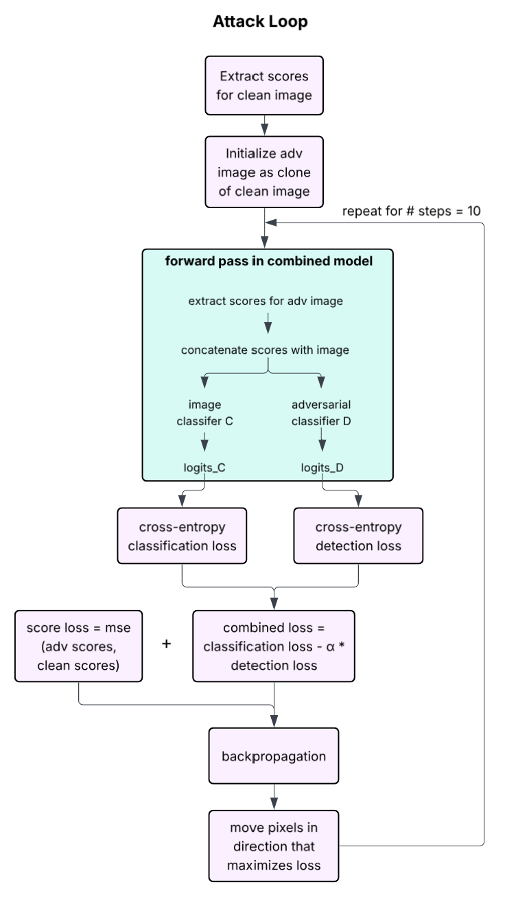

# scoreadv-adaptive-attack

## High level pipeline overview

- 25,000 clean images from CIFAR-10 \
&darr; pretrained diffusion model \
&darr; score6, score3, score0 \
&darr; concatenate scores  (B, 3*k, H, W) \
&darr; concatenate with image \
&darr; classifier c -> logits_C \
&darr; classifier D -> logits_D \
&darr; logits_C, lotigs_D -> combined loss \
&darr; backprop with loss \
&darr; pgd update to image (move pixels in the direction that maximizes loss) 

## Breakdown of pipeline 
_combined_model.py_

- def __init__(self, score_model, classifier_C,  classifier_D, noise_levels, img_mean, img_std, score_means, score_stds, score_indices=(6, 3, 0), ):
- Forward pass: 
    - Get the score maps for the batch x
    - I think we want to treat the diffusion model as a feature extractor, so i used .detach() to prevent the gradients from entering the diffusion model
    - Normalize exactly as we did in training 
    - Build the input to classifiers C and D x_in as
      - Stack the x pixel info with the score info 
      - Have 3 scores, so each score map has 3 channels, total = 12 channels 
    - Pass x_in through classifier C to get logits_C
    - Pass x_in through classifier D to get logits_D
    - Return logits_C, logits_D, scores

_adaptive_attack.py_

- Define loss functions
  - classification_loss
    - Cross entropy loss between logits and image labels
  - detection_loss
    - Cross entropy loss between logits and whether the image is adv or not
  - combined loss
    - classification_loss - alpha * detection_loss
    - Maximizes classification loss to fool classifier D 
    - Minimizes detection loss to try to fool classifier C and look “clean”

   
- Pgd attack
  - Works on batches of images (x) 
  - “Attacks” the combined model 
  - Get scores for the current batch of images (clean images) once at the beginning 
  - Initialize the adversarial image batch x_adv as a clone of clean batch x
    - PGD loop
      - Pass x_adv through the combined model. Returns logits for classifier C, logits for classifier D, and adv_scores
      - Define the clean target labels for the detector to be 0 (0 = clean, 1 = adv)
      - Calculate the combined loss
      - Score loss = mse loss between adv_scores just calculated and the clean scores gotten at the beginning (before attack loop) 
      - Combine loss from combined loss and score loss 
      - loss.backward() backward pass 
      - Alter batch x_adv, maximizing the loss (move pixels in the direction that maximizes loss)

- Evaluation
  - Classification Accuracy
      - How often the classifier D correctly identifies the true label $y$ of the adversarial image
      - Lower is better for the attacker      
  - Attack Success Rate
    - A "dual-condition" success: The image is misclassified (prob < threshold) AND the detector thinks it's clean (prob > threshold).
    - This is the "true" success of a stealthy attack
  - Image MSE
    - The L2 distance between the clean image x and adversarial image x_adv
    - Measures how much the image was physically altered
  - Score MSE
    - The difference between the diffusion scores of the clean and adversarial images
    - Measures how much the attack "broke" the statistical distribution of the data

 
- Run full attack (run_experiement)
  - Use CIFAR-10 for input data (all clean images) for now just has 25,000 
  - Evaluates the model on batch x of clean images first to establish a "normal" accuracy benchmark
  - Calls pgd_attack to generate adversarial versions of the current batch of images
  - Evaluates the model again using the adversarial images to see how many samples fooled the classifier and the detector
  - Accumulates totals for clean accuracy, adversarial accuracy, attack success rate, and image distortion (MSE)
 
- Main 
  - Load checkpoints for the diffusion model, classifier C, and classifier D 
  - Feed to combined model the score model, classifier C, classifier D, noise levels, and the core indices (6, 3, 0)
  - Call run_experiment 

&emsp;&emsp;&emsp;&emsp;&emsp;&emsp;

